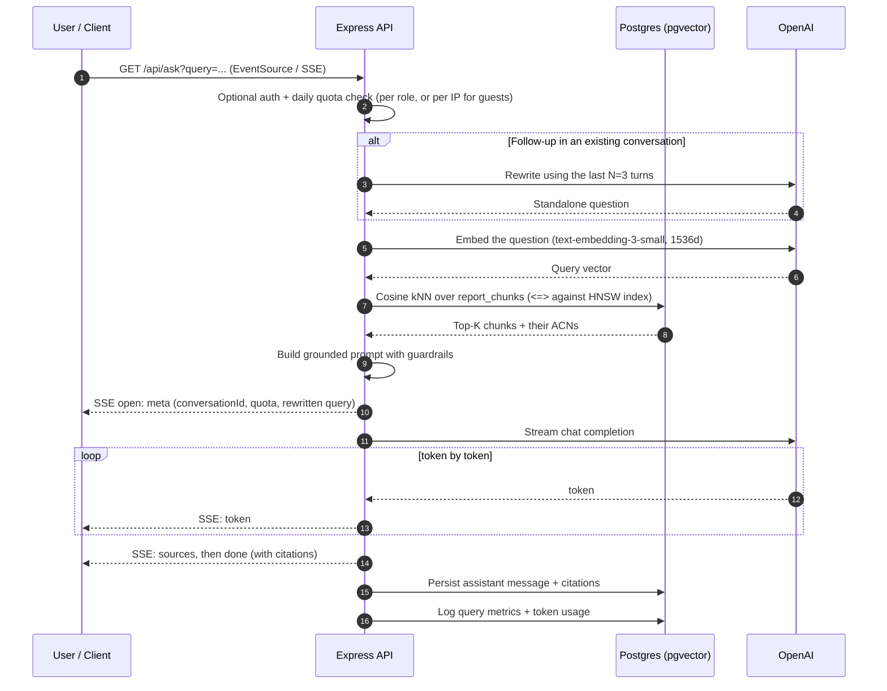
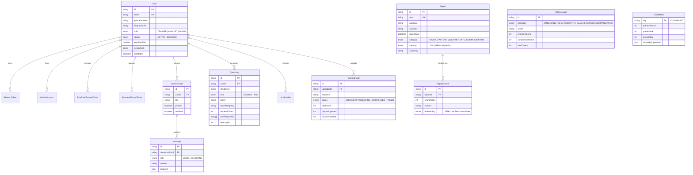

# Nasight

**Ask about aviation safety in plain English. Get answers grounded in real NASA ASRS incident reports — with sources you can check.**

Nasight is a full-stack web application that makes the NASA Aviation Safety Reporting System searchable by conversation instead of by keyword. It's built as three deployable applications around one Postgres database, and this file is the map. Each application has its own README with the detail:

- **[`server/`](server/README.md)** — Express API + background worker. Auth, vector search, the RAG pipeline, ingestion queue.
- **[`client/`](client/README.md)** — Next.js app for end users. Chat, report browsing, accounts.
- **[`admin/`](admin/README.md)** — React + Vite dashboard. Metrics, user management, corpus uploads, broadcasts.

For the full technical write-up see [`documentation.md`](documentation.md); for requirements and scope see [`PRD.md`](PRD.md).

---

## The problem

The ASRS holds over two million confidential incident reports filed voluntarily by pilots, controllers, cabin crew and mechanics since 1988. It's an extraordinary safety resource that's genuinely hard to use:

- **You have to guess the keywords.** Finding reports about fatigue on a night approach means knowing the right codes and filter combinations up front. If you don't know the vocabulary, you don't find the reports.
- **The narratives are dense with jargon.** They're written by professionals for professionals, thick with acronyms. A student pilot or a researcher from outside aviation has to decode before they can learn.
- **There's too much of it.** Spotting a pattern across hundreds of narratives means reading hundreds of narratives.

## The approach

Report narratives are chunked, embedded, and stored in Postgres with `pgvector`. A question gets embedded the same way, matched against those chunks by cosine similarity, and the retrieved text — and *only* the retrieved text — is handed to a language model to answer from.

That constraint is the whole design. The model isn't a source of aviation knowledge here; it's a summarizer of retrieved reports. Every answer carries the ASRS Accession Numbers it drew from, so a claim can always be traced back to a real filed report. When nothing relevant is retrieved, the honest "no relevant reports found" answer is returned rather than an invented one.

On top of that: multi-turn conversations where follow-ups are rewritten to stand alone, token-by-token streaming so answers appear immediately, role-based quotas to keep costs bounded, and an asynchronous ingestion pipeline so loading thousands of reports never blocks a request.

---

## How it fits together

```
┌─────────────────────────────────────────────────────────────────────────┐
│                              CLIENT LAYER                               │
│                                                                         │
│   ┌───────────────────────────────┐   ┌─────────────────────────────┐   │
│   │     User Frontend (client)    │   │   Admin Frontend (admin)    │   │
│   │   Next.js 16 (App Router)     │   │      React 19 + Vite        │   │
│   │    Redux Toolkit, Tailwind    │   │    Redux Toolkit, Tailwind  │   │
│   └───────────────┬───────────────┘   └──────────────┬──────────────┘   │
└───────────────────┼──────────────────────────────────┼──────────────────┘
                    │ HTTPS / REST / SSE               │ HTTPS / REST
                    ▼                                  ▼
┌─────────────────────────────────────────────────────────────────────────┐
│                              SERVER LAYER                               │
│                                                                         │
│   ┌─────────────────────────────────────────────────────────────────┐   │
│   │                    Express 5 Backend (server)                   │   │
│   │  Auth (JWT / OAuth), Controller / Route Logic, SSE Stream Pipe  │   │
│   └───────────────┬───────────────────────────┬─────────────────────┘   │
└───────────────────┼───────────────────────────┼─────────────────────────┘
                    │                           │
                    ▼                           ▼
┌──────────────────────────────────┐ ┌────────────────────────────────────┐
│          SERVICE LAYER           │ │          WORKER PROCESS            │
│                                  │ │                                    │
│ ┌──────────────┐ ┌─────────────┐ │ │ ┌────────────────────────────────┐ │
│ │ Retrieval    │ │ LLM / Embed │ │ │ │ server/src/worker.ts           │ │
│ │ Service      │ │ Service     │ │ │ │ pg-boss: ingestion + rollups   │ │
│ └──────┬───────┘ └──────┬──────┘ │ │ └──────────────┬─────────────────┘ │
└────────┼────────────────┼────────┘ └────────────────┼───────────────────┘
         │                │                           │
         ▼                ▼                           ▼
┌─────────────────────────────────────────────────────────────────────────┐
│                            DATA & EXTERNAL                              │
│                                                                         │
│  ┌───────────────────────────────┐    ┌──────────────────────────────┐  │
│  │   PostgreSQL + pgvector DB    │    │      External AI Provider    │  │
│  │ (Prisma 7, HNSW cosine index) │    │  (OpenAI Embeddings / Chat)  │  │
│  └───────────────────────────────┘    └──────────────────────────────┘  │
└─────────────────────────────────────────────────────────────────────────┘
```

Four processes, three codebases. The worker isn't a separate project — it's a second entry point (`server/src/worker.ts`) sharing the API's code and database, run as its own process so long ingestion jobs never sit in the request path. In production it deploys as a separate service.

The frontends talk only to the API. Neither one holds a database connection, an API key, or any business logic.

---

## How a question gets answered



Three details worth calling out:

**It's a `GET`, not a `POST`.** The browser's native `EventSource` only issues GETs, and it's the right client for SSE.

**Follow-up rewriting is load-bearing.** *"What was the weather in that one?"* embeds into nothing useful. Rewritten against the prior turns into *"What were the weather conditions during the night approach in ACN 123456?"*, it retrieves correctly. Skipping this step is where naive multi-turn RAG falls apart.

**Compression is explicitly disabled for `text/event-stream`.** Otherwise gzip buffers the response and your "streaming" answer arrives in a single lump at the end.

---

## The data model

Fourteen tables in four functional zones — identity, corpus, conversation, and activity/metrics. The full diagram is in [`Nasight-ERD.drawio`](Nasight-ERD.drawio) (open it in draw.io) with a rendered copy alongside it.



`TokenUsage` and `DailyMetric` deliberately have no foreign keys — they're an append-only audit trail that survives user deletion, rolled up nightly so the admin dashboard doesn't aggregate over raw history forever.

---

## Roles and quotas

| | Guest | Trainee | Analyst | Admin |
|:---|:---:|:---:|:---:|:---:|
| **Sign-in** | none | email or Google | email or Google | email or Google |
| **Daily questions** | 2 per IP | 30 | 100 | unlimited |
| **Chat history saved** | no | yes | yes | yes |
| **Report triage list** | no | no | yes | yes |
| **Corpus CSV upload** | no | no | no | yes |
| **User & role management** | no | no | no | yes |
| **Broadcast notifications** | no | no | no | yes |

Quotas are counted per UTC day and enforced server-side in middleware, not in the UI.

### Security

- Passwords hashed with **bcrypt, 12 rounds**.
- Refresh tokens, email verification codes and password reset codes are stored as **SHA-256 hashes** — a database leak doesn't hand over usable credentials.
- Sessions are short-lived JWT access tokens (15 min) plus rotating refresh tokens (30 days), both in **httpOnly cookies**. No token is ever readable from JavaScript.
- Google OAuth runs through Passport **statelessly** (`session: false`) — Passport performs the code exchange, our callback issues the same cookies as a password login.
- `helmet`, an explicit CORS origin allowlist (never a wildcard), and rate limiting on auth routes.
- Retrieval uses an **HNSW index** on cosine distance, so similarity search stays fast as the corpus grows.

---

## Running the whole thing locally

You'll need Node 20+ and a Postgres 15+ database with `pgvector`. Neon's free tier is what this was developed against.

Each app has its own setup section — [server](server/README.md), [client](client/README.md), [admin](admin/README.md) — but the short version is:

```bash
# 1. Database + API
cd server
npm install
cp .env.example .env          # set DATABASE_URL, JWT_ACCESS_SECRET, PORT=8000
npm run prisma:generate
npm run prisma:migrate
npm run seed                  # optional sample corpus

# 2. Frontends
cd ../client && npm install && cp .env.example .env.local
cd ../admin  && npm install && cp .env.example .env
```

Then four terminals:

```bash
cd server && npm run dev        # API      → http://localhost:8000
cd server && npm run worker     # worker   (no HTTP port)
cd client && npm run dev        # user app → http://localhost:3000
cd admin  && npm run dev        # admin    → http://localhost:3001
```

Only `DATABASE_URL` and `JWT_ACCESS_SECRET` are truly required — the server refuses to boot without them. Without `OPENAI_API_KEY` the pipeline still runs on a deterministic dev stub (useful for working on everything that isn't the AI); without SMTP credentials, verification codes are printed to the API console instead of emailed.

Interactive API docs are at `http://localhost:8000/api/docs` in non-production.

---

## Repository layout

```
nasight/
├── README.md               # you are here
├── documentation.md        # the full technical reference
├── PRD.md                  # product requirements
├── Nasight-ERD.drawio      # database diagram (draw.io source)
│
├── server/                 # Express API + background worker  → server/README.md
│   ├── prisma/             # schema + migrations (incl. the HNSW index)
│   └── src/
│       ├── server.ts       # API entry point
│       ├── worker.ts       # worker entry point
│       ├── controllers/  services/  routes/  middlewares/
│       ├── config/         # env validation, prisma, passport, queue, swagger
│       └── scripts/seed.ts
│
├── client/                 # Next.js user app                 → client/README.md
│   └── src/app/  components/  store/  hooks/  lib/
│
└── admin/                  # React + Vite dashboard           → admin/README.md
    └── src/pages/  components/  store/  routes/  lib/
```

---

## API surface

Everything is under `/api`.

| Group | Endpoints |
|---|---|
| **System** | `GET /health` · `GET /docs` (non-production only) |
| **Auth** `/auth` | `POST /register` · `POST /verify-email` · `POST /login` · `POST /forgot-password` · `POST /reset-password` · `POST /refresh` · `POST /logout` · `GET /me` · `GET /google` · `GET /google/callback` |
| **Users** `/users` | `PATCH /me` · `PUT /me/avatar` · `DELETE /me/avatar` |
| **Q&A** `/ask` | `GET /` — grounded answer streamed over SSE; auth optional, quota enforced |
| **Conversations** `/conversations` | `GET /` · `GET /:id` · `PATCH /:id` (pin/archive/rename) · `DELETE /:id` |
| **Reports** `/reports` | `GET /` — filterable triage list, analyst/admin only · `GET /:id` — any signed-in user |
| **Notifications** `/notifications` | `GET /` · `PATCH /read-all` · `PATCH /:id/read` |
| **Admin** `/admin` | `GET /metrics` · `GET /users` · `PATCH /users/:id/role` · `PATCH /users/:id/status` · `POST /notifications` · `POST /ingestions` · `GET /ingestions` · `GET /ingestions/:id` |

Two things work implicitly rather than through their own endpoint: **conversations** are created for you when a signed-in user asks a question (the id comes back on the SSE `meta` event), and **report summaries** are generated on first view of `GET /reports/:id` and cached on the row.

---

## For the write-up

The project was built to support a paper on applied RAG in a specialist safety domain. The parts with something to say:

1. **Hallucination control by construction** — enforced citation and a similarity floor, so an unanswerable question produces a refusal instead of a plausible fabrication.
2. **Multi-turn retrieval via query rewriting** — measurable retrieval accuracy difference between raw follow-ups and rewritten standalone queries.
3. **HNSW indexing in pgvector** — similarity search latency over thousands of chunks, without a dedicated vector database.
4. **Two-layer cost governance** — per-IP limits for anonymous traffic, per-role daily quotas for accounts, plus hard output-token caps in code (not environment variables, so a config change can't lift the ceiling).
5. **Decoupled ingestion** — a queue-backed worker keeping embedding workloads off the streaming request path.

---

## License & citation

ISC. Built as an engineering checkpoint for semantic aviation safety analysis over NASA ASRS data.

```bibtex
@misc{nasight2026,
  author = {Abdullahi},
  title = {Nasight: Grounded Retrieval-Augmented Generation for NASA Aviation Safety Reports},
  year = {2026},
  publisher = {GitHub},
  howpublished = {\url{https://github.com/Phenomenal5/cloud-base-web-app.git}}
}
```
